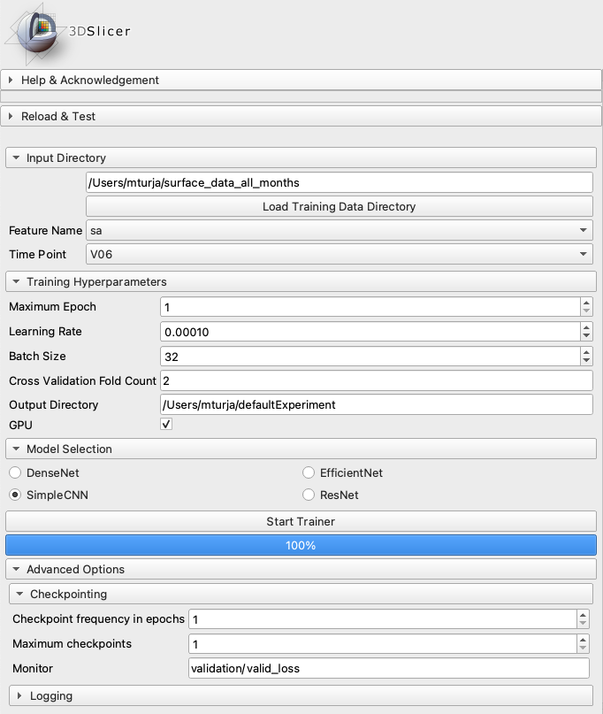

# SlicerDeepLearningUI

## Introduction
This module enables the user to easily train complex deep learning models (such as ResNet, EfficientNet, CNN, etc.) without the need for any coding. Given that the training dataset is in a certain format (explained later), all the user has to do is input the data directory, select a model from a model pool and push the `Start Trainer` button. The rest will be taken care of by this extension. Advanced users can also use the training code without the interface as the interface is completely separate from the training code. It's also quite straightforward to add custom data loaders and models.
## How to use
[Link to video]((https://www.youtube.com/watch?v=54EK092QdEE))
### Data preparation
For the module to work, the user has to organize the data in the following manner:
```
root_data_folder
| ---- subject_id
       | ---- time_stamp
              | ---- feature_name
                     | ---- left_<feature_name>_flat.jpeg
                     | ---- right_<feature_name>_flat.jpeg
```
So for each subject, there can be data for multiple timestamps and multiple feature set. The user can choose to train the model for a particular timestamp and a particular feature set. For example, in the following example, each subject has features at two time points -- 6 months (V06) and 12 months (V12). For each of these time points the subject has 3 feature sets -- cortical thickness (thickness), surface area (sa), and, local ea-csf (eacsf). The jpeg images are 2D images for left and right hemisphere of the brain. The shape of the images must match across hemisphere and population.
#### Example:

## Environment Setup
Install the following libraries using `pip` in Slicer-Python environment
```
monai==0.7.0
numpy==1.19.2
pytorch_lightning==1.4.9
pandas==1.1.5
torch==1.9.0
torchmetrics==0.6.0
```
## Steps to follow
1. Load training data directory into the module
2. Select feature and timepoint for which to train
3. Change hyperparamters as needed
4. Select model from 4 choices. All these models are taken from [MONAI](https://docs.monai.io/en/stable/networks.html#):
   - [DenseNet](https://arxiv.org/pdf/1608.06993.pdf)
   - [EfficientNet](https://arxiv.org/pdf/1905.11946.pdf)
   - [SimpleCNN](https://github.com/mturja-vf-ic-bd/SlicerDeepLearningUI/blob/main/DeepLearner/src/models/cnn_model.py)
   - [ResNet](https://arxiv.org/pdf/1512.03385.pdf)
5. Change advance options if necessary.
6. After training, check the Output Directory for saved models and tensorboard logs.
      
